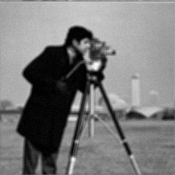

# AddNoiseBlur Algorithm

1. ```./compilegcc AddNoiseBlur```
2. ```./AddNoiseBlur```
3. Input the size of lowpass filter mask. For example: ```5``` 
4. Input the variance of noise. For example: ```20``` (Gaussien noise)
5. Results
<br>




